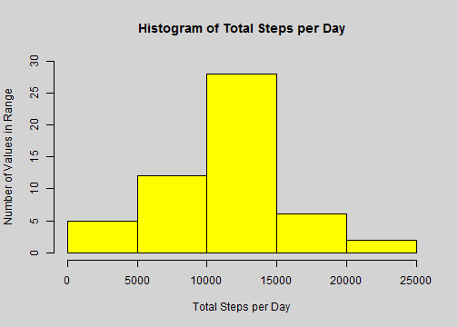
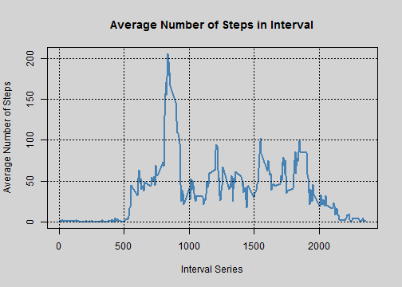
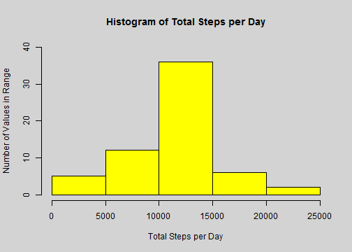
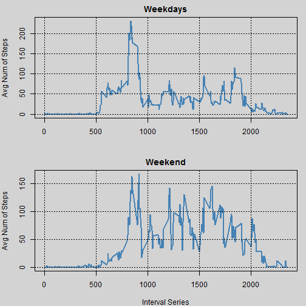

Activity Monitoring Case Study
==============================

## 0. Introduction

It is now possible to collect a large amount of data about personal movement using activity monitoring devices. Device used in this case study collects data at 5 minute intervals through out the day. The data consists of two months of data from an anonymous individual collected during the months of October and November 2012 and include the number of steps taken in 5 minute intervals each day.  

The variables included in this dataset are:  

* steps: Number of steps taken in a 5-minute interval (missing values are coded as NA)

* date: The date on which the measurement was taken in YYYY-MM-DD format

* interval: Identifier for the 5-minute interval in which measurement was taken

The dataset is stored in a comma-separated-value (CSV) file and there are a total of 17,568 observations in this dataset.


## 1. Loading and preprocessing the data

The dataset is stored in the 'activity.csv' file.  
Create a string variable containing dataset file name and load the dataset into the corresponding data frame (act_mon):

```r
act_mon_filename <- "activity.csv"
act_mon <- read.csv(act_mon_filename, header=T, stringsAsFactors=F)
```
Do note that dataset is loaded with option 'header' set to 'TRUE' and option 'stringsAsFactors' set to 'FALSE' in order to keep the date variable as character type.

`dim()` function gives information about data frame dimensions:

```r
dim(act_mon)
```

```
## [1] 17568     3
```

`str()` function will provide useful attribute specification information about activity monitoring dataset:

```r
str(act_mon)
```

```
## 'data.frame':	17568 obs. of  3 variables:
##  $ steps   : int  NA NA NA NA NA NA NA NA NA NA ...
##  $ date    : chr  "2012-10-01" "2012-10-01" "2012-10-01" "2012-10-01" ...
##  $ interval: int  0 5 10 15 20 25 30 35 40 45 ...
```

One can also use the `summary()` function to quickly explore the basic dataset statistics:

```r
summary(act_mon)
```

```
##      steps            date              interval     
##  Min.   :  0.00   Length:17568       Min.   :   0.0  
##  1st Qu.:  0.00   Class :character   1st Qu.: 588.8  
##  Median :  0.00   Mode  :character   Median :1177.5  
##  Mean   : 37.38                      Mean   :1177.5  
##  3rd Qu.: 12.00                      3rd Qu.:1766.2  
##  Max.   :806.00                      Max.   :2355.0  
##  NA's   :2304
```
Interesting thing to note is the number of missing values, which seem to appear only in the 'steps' variable.

## 2. Mean total number of steps taken per day

Aggregate steps over days in terms of summation in order to obtain total number of steps taken per day:

```r
step_per_day <- aggregate(steps~date, data=act_mon, sum)
```
Resulting data frame 'step_per_day' contains days of observations and corresponding total number of steps.  
Amount of total steps taken for each day divided by intervals is represented by the histogram:

```r
par(bg="lightgray", col="black")
hist(step_per_day$steps,
     col="yellow", 
     main="Histogram of Total Steps per Day", 
     ylim=c(0, 30), 
     xlab="Total Steps per Day", 
     ylab="Number of Values in Range")
```

 

Mean value of the total number of steps taken each day is:

```r
step_per_day_mean <- mean(step_per_day$steps)
step_per_day_mean
```

```
## [1] 10766.19
```

Median value of the total number of steps taken each day is:

```r
step_per_day_median <- median(step_per_day$steps)
step_per_day_median
```

```
## [1] 10765
```

## 3. Average daily activity pattern

Average number of steps taken for each 5-minute interval across all days is calculated by using `aggregate()` function:

```r
daily_act <- aggregate(steps~interval, data=act_mon, mean)
```
Resulting data frame 'daily_act' therefore contains 5-minute interval and corresponding average number of steps averaged across all days, which is also presented by the time series plot:

```r
par(bg="lightgray", col="black")
plot(daily_act$interval, daily_act$steps,
     type="l",
     col="steelblue",
     lwd=2,
     main="Average Number of Steps in Interval",
     xlab="Interval Series",
     ylab="Average Number of Steps",
     )
grid(col="black")
```

 

To calculate the 5-minute interval which on average across all days contains maximum number of steps one can use the statement:

```r
max_step_interval <- daily_act[daily_act$steps==max(daily_act$steps), "interval"]
```
Resulting 5-minute interval with maximum number of steps is: **835**.

## 4. Imputing missing values

To calculate the total number of missing values in the dataset the following statements are used:

```r
mv_ind_total <- !complete.cases(act_mon)
mv_num_total <- sum(mv_ind_total)
```
Note that `complete.cases()` functions returns logical vector of row index where there's no missing value. By negating that vector, one obtains logical vector with indexes of rows where there are missing values. Since logical 'TRUE' is also presented as value '1', summation function will return the number of rows with missing values: **2304**.

How much of missing values is placed in the steps variable?

```r
mv_num_steps <- sum(is.na(act_mon$steps))
```
Since 'steps' variable holds **2304** missing values it is obvious that consequently holds all missing values in the dataset, which also could be concluded according to the result of `summary()` function.

In order to fill in the missing values of the dataset, average number of steps for corresponding 5-minute interval will be taken.  
Note that dataframe holding that information is calculated (daily_act) so corresponding values will be placed in the activity monitoring data frame instead of missing values:

```r
daily_act_fill <-daily_act[rep(1:nrow(daily_act),times=nrow(act_mon)/nrow(daily_act)),]
act_mon_fill <- act_mon
act_mon_fill[mv_ind_total, "steps"] <- daily_act_fill[mv_ind_total, "steps"]
```
New dataset 'act_mon_fill' contains no missing values.
Again, total number of steps taken each day is calculated:

```r
step_per_day_fill <- aggregate(steps ~ date, data=act_mon_fill, sum)
```
Resulting data frame 'step_per_day_fill' contains days of observations and corresponding total number of steps.  
Amount of total steps taken for each day divided by intervals is represented by the histogram:

```r
par(bg="lightgray", col="black")
hist(step_per_day_fill$steps,
     col="yellow", 
     main="Histogram of Total Steps per Day", 
     ylim=c(0, 40), 
     xlab="Total Steps per Day", 
     ylab="Number of Values in Range")
```

 

Mean value for the total number of steps is:

```r
total_step_mean <- mean(step_per_day_fill$steps)
total_step_mean
```

```
## [1] 10766.19
```
Median value for the total number of steps is:

```r
total_step_median <- median(step_per_day_fill$steps)
total_step_median
```

```
## [1] 10766.19
```
As one could expect, mean value for the total number of steps taken per day is equal in both cases when there are missing values in the dataset and when there are none i.e. missing values are replaced by the average steps taken for each 5-minute interval.
Nevertheless, median value differs for those two cases, because replacing missing values changed the vector's numeric structure.

## 5. Differences in activity patterns between weekdays and weekends

One needs to set the System Time Settings to 'English':

```r
Sys.setlocale("LC_TIME", "C")
```

```
## [1] "C"
```

New factor variable in the dataset with two levels – 'weekday' and 'weekend' indicating whether a given date is a weekday or weekend day is created:

```r
act_mon_fill$date <- strptime(act_mon_fill$date, "%Y-%m-%d")
act_mon_fill$date <- weekdays(act_mon_fill$date)
act_mon_fill$day_type <- factor(ifelse(act_mon_fill$date%in%c("Saturday","Sunday"),"weekend", "weekday"))
```

Average number of steps taken for each 5-minute interval, averaged across all weekday days or weekend days, is calculated:

```r
daily_act_type <- aggregate(steps ~ interval+day_type, data=act_mon_fill, mean)
```

Resulting data frame 'daily_act_type' contains 5-minute interval and corresponding average number of steps averaged across all weekday days or weekend days, which is also presented by the time series plot:

```r
par(mfrow = c(2,1), mar = c(4, 4, 2, 1))
par(bg="lightgray", col="black")
plot(steps ~ interval, daily_act_type[daily_act_type$day_type=="weekday", ],
     type="l",
     col="steelblue",
     lwd=2,
     main="Weekdays",
     xlab="",
     ylab="Avg Num of Steps"
)
grid(col="black")
plot(steps ~ interval, daily_act_type[daily_act_type$day_type=="weekend", ],
     type="l",
     col="steelblue",
     lwd=2,
     main="Weekend",
     xlab="Interval Series",
     ylab="Avg Num of Steps"
)
grid(col="black")
```

 

It can be seen that although patterns are fairly similar, larger number of steps in average is taken during the weekends.
